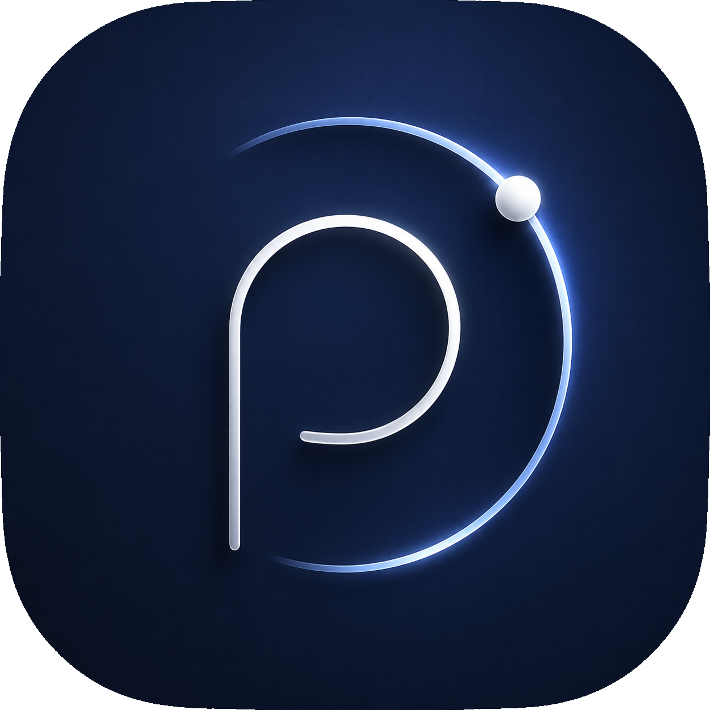

<div align="center">
  
  <h1>Poinyta</h1>
  <p><strong>Panel personal local-first — tareas, notas, finanzas, wishlist, metas y clima</strong></p>
  <p>
    <a href="#caracteristicas">Características</a> •
    <a href="#capturas">Capturas</a> •
    <a href="#instalacion">Instalación</a> •
    <a href="#uso">Uso</a> •
    <a href="#licencia">Licencia</a>
  </p>
  <p>
    
    
    
  </p>
</div>

---

## Características

- **Tareas** — Gestión simple de pendientes con estado completado
- **Notas** — Notas rápidas append-only
- **Finanzas** — Registro de ingresos y gastos con estadísticas mensuales
- **Wishlist** — Lista de deseos con obtención automática de metadatos
- **Metas** — Metas con pasos y sistema de puntos
- **Clima** — Clima actual basado en ubicación
- **Sincronización opcional** — Puente Express para automatizaciones vía n8n
- **Modo oscuro** — Tema claro/oscuro/sistema
- **Local-first** — Tus datos viven en el dispositivo, privacidad por defecto

## Stack tecnológico

| Capa | Tecnología |
| --- | --- |
| Framework | React Native 0.81 + Expo SDK 54 |
| Routing | Expo Router (file-based) |
| Lenguaje | TypeScript 5.9 (strict) |
| Base de datos | SQLite con WAL |
| Seguridad | expo-secure-store |
| UI | Componentes propios + @expo/vector-icons |
| Bridge | Node.js + Express |

## Instalación

```bash
# Clonar el repositorio
git clone https://github.com/IntoCode/poinyta.git
cd poinyta

# Instalar dependencias
npm install

# Iniciar en desarrollo
npx expo start
```

Para compilar en Android:

```bash
npx eas build --platform android --profile preview
```

## Uso

1. Escanea el código QR con Expo Go o conecta un dispositivo físico
2. Completa el onboarding con tu nombre
3. Explora las secciones desde la navegación inferior
4. Opcional: configura la sincronización en Ajustes

## Licencia

```
MIT License

Copyright (c) 2024 IntoCode

Permission is hereby granted, free of charge, to any person obtaining a copy
of this software and associated documentation files (the "Software"), to deal
in the Software without restriction, including without limitation the rights
to use, copy, modify, merge, publish, distribute, sublicense, and/or sell
copies of the Software, and to permit persons to whom the Software is
furnished to do so, subject to the following conditions:

The above copyright notice and this permission notice shall be included in all
copies or substantial portions of the Software.

THE SOFTWARE IS PROVIDED "AS IS", WITHOUT WARRANTY OF ANY KIND, EXPRESS OR
IMPLIED, INCLUDING BUT NOT LIMITED TO THE WARRANTIES OF MERCHANTABILITY,
FITNESS FOR A PARTICULAR PURPOSE AND NONINFRINGEMENT. IN NO EVENT SHALL THE
AUTHORS OR COPYRIGHT HOLDERS BE LIABLE FOR ANY CLAIM, DAMAGES OR OTHER
LIABILITY, WHETHER IN AN ACTION OF CONTRACT, TORT OR OTHERWISE, ARISING FROM,
OUT OF OR IN CONNECTION WITH THE SOFTWARE OR THE USE OR OTHER DEALINGS IN THE
SOFTWARE.
```

---

<div align="center">
  <p>
    Desarrollado y mantenido por <strong>IntoCode</strong> &mdash; Open source, libre y gratuito.
  </p>
  <p>
    <a href="https://github.com/IntoCode">IntoCode</a> •
    <a href="https://github.com/IntoCode/poinyta/issues">Reportar un problema</a>
  </p>
</div>
